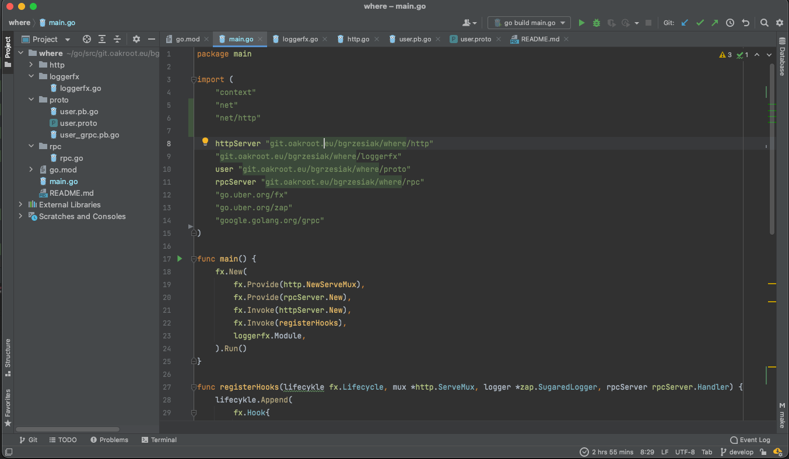
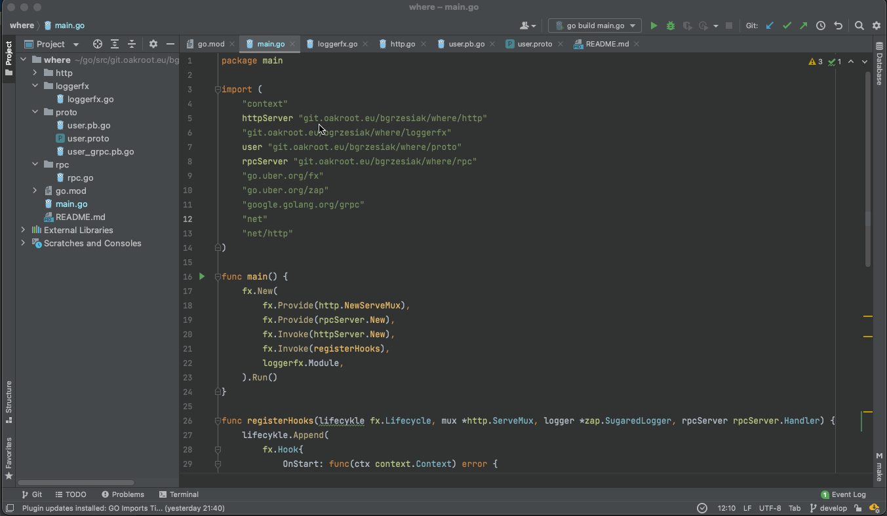

# go-imports-tidy
<!-- Plugin description -->
This tool updates your Go import lines, grouping it into three groups:
- stdlib,
- external libraries,
- local libraries (optional).
<!-- Plugin description end -->

The plugin is based on the golang application [goimportstidy](https://github.com/krzysztofdrys/goimportstidy) by [Krzysztof Dryś](https://github.com/krzysztofdrys).

## Installation
1. Inside your IDE, select Preferences -> Plugins. 
2. Search for GO Imports Tidy. 
3. Click the green "Install" button. 
4. Re-launch your IDE.

## Configuration
The configuration of the plugin is solely within the scope of the project. 

## How it works

[comment]: <DISABLED> (Formatting of `imports` starts automatically after the file is saved. )
You can run formatting manually from contextual menu:

From tools menu:

